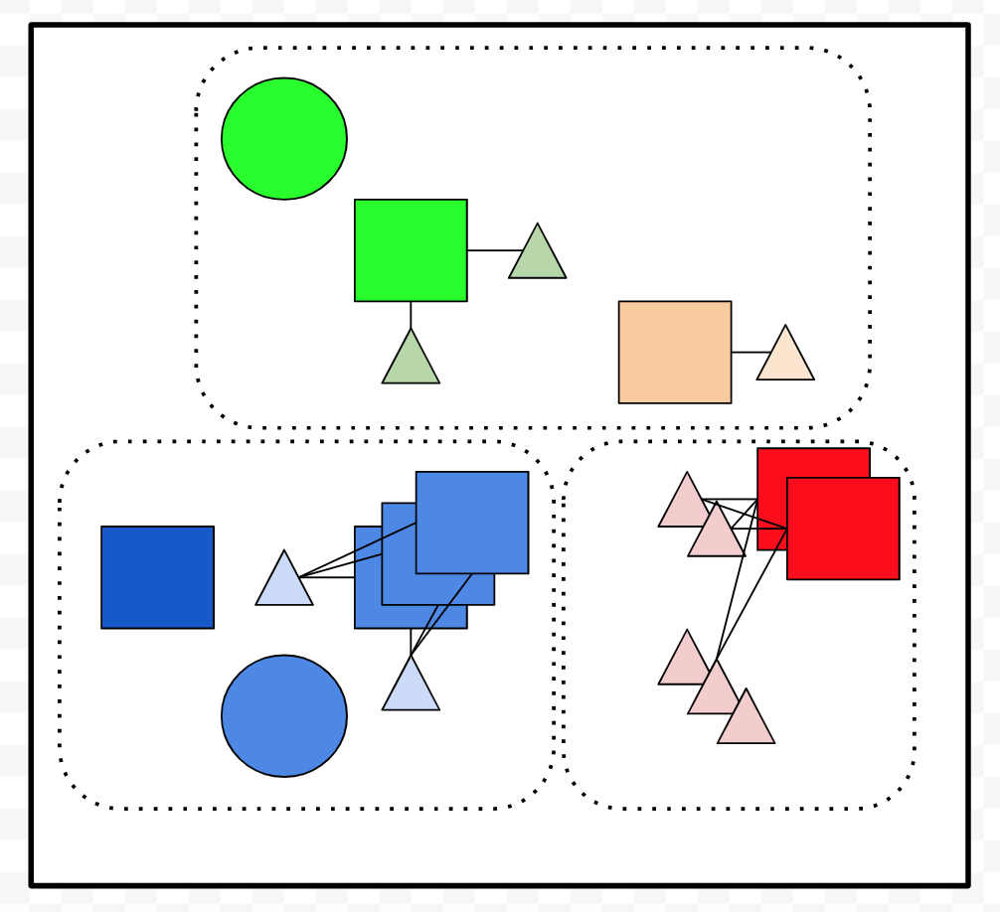
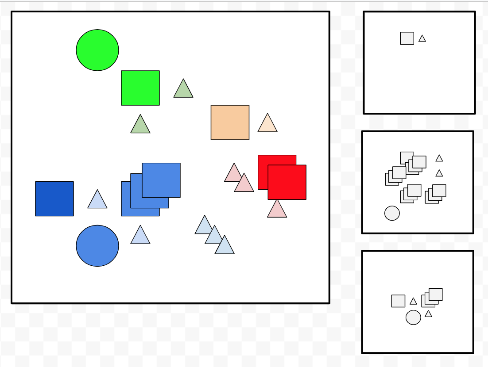

# kubernetes

## A Plan

1) Connect related resources by name to make components.

2) Add lifecycle labels to order the rollout of resources (ex to ensure the latest configs/secrets are available, or to make sure db migrations go before a server rollout).

3) Use namespaces to avoid collisions.

4) Use [checksum annotations](https://github.com/helm/helm/blob/master/docs/charts_tips_and_tricks.md#automatically-roll-deployments-when-configmaps-or-secrets-change) to ensure pod changes when configs/secrets change.

## Mechanics of Labels

Use labels to make groups and selectors to pick them.

```bash
kubectl apply -f timepod6.yml
kubectl get pods
kubectl get pods -l 'group=one'
kubectl get pods -l 'group=two'
kubectl get pods -l 'group in (one)'
kubectl get pods -l 'group in (one,two)'
```

Label selectors work in lots of places.

```bash
kubectl logs -l 'group in (one)'
kubectl delete pods -l 'group in (one)'
kubectl get pods
kubectl delete pods -l 'group in (one,two)'
kubectl get pods
```

Importantly labels work to select across a stream.  This is picking from an input list that we feed in.

```bash
kubectl apply -f timepod6.yml -l 'group in (one)'
kubectl get pods
kubectl apply -f timepod6.yml
kubectl delete -f timepod6.yml -l 'group in (one)'
kubectl get pods
```

It also works server side with whatever is existing.  The labels are scoping both sides of the equation before doing any create/update/prune activity (note you MUST pick `--all` or provide a selector for prune, so you have to do one of the following).

```bash
# prune without labels
kubectl apply -f timepod6.yml
kubectl get pods
kubectl apply -f timepod6a.yml --prune --all
kubectl get pods
kubectl delete pod --all

# prune with labels
kubectl apply -f timepod6.yml
kubectl get pods
kubectl apply -f timepod6a.yml --prune -l 'group in (one)'
kubectl get pods
kubectl delete pod --all
```

Lastly labels/selection is scoped to namespaces.

## Mechanics of Namespaces

You always have a namespace, the "default" namespace by default.

```bash
kubectl get namespaces
kubectl config get-contexts
```

Namespaces are a hassle to work with.  Lots of verbose flags and confusing things, but it gives you encapsulation for your resources.

```bash
kubectl create namespace timepod6-thefirst
kubectl config set-context $(kubectl config current-context) --namespace=timepod6-thefirst
kubectl apply -f timepod6.yml
kubectl get pods

kubectl create namespace timepod6-thesecond
kubectl config set-context $(kubectl config current-context) --namespace=timepod6-thesecond
kubectl apply -f timepod6.yml
kubectl apply -f timepod6a.yml
kubectl get pods

kubectl get pods --all-namespaces
```

The best thing for namespaces is to make their usage transparent.  To do that we can use a configuration trick -- utilize kubeconfig files.  To understand the trick you need to know a few things.

1) You have a kubeconfig file where all the `kubectl config` lives.

```
# secrets are in this file so I'll only show the structure...
sed -e 's/:.*/: .../' ~/.kube/config
```

2) There is an ENV variable that sets where `kubectl` looks for kubeconfig files: `KUBECONFIG`.  It is a `:` separated list of paths.  Whatever files are found are *merged*.  It's not like PATH where the first thing found is what is used... rather it's like an overlay where kubeconfig goes in reverse order so the first thing in KUBECONFIG wins.  Relative paths are ok in KUBECONFIG.

3) `kubeconfig` provides some flags to help you make and manage these files.

Now the trick.  Envision a directory as a namespace.  Make a `.kubeconfig` file in the directory setting the namespace according to the directory name.  Set KUBECONFIG to pickup that file.  Now whenever you enter the directory, you enter the namespace.

```bash
export KUBECONFIG=".kubeconfig:$HOME/.kube/config"

mkdir timepod6-thefirst
cd timepod6-thefirst
kubectl config view --minify -o json | jq '{"current-context": ."current-context", contexts: .contexts}' > .kubeconfig
kubectl --kubeconfig .kubeconfig config set-context $(kubectl config current-context) --namespace="$(basename "$PWD")"
kubectl get pods
cd ..

mkdir timepod6-thesecond
cd timepod6-thesecond
kubectl config view --minify -o json | jq '{"current-context": ."current-context", contexts: .contexts}' > .kubeconfig
kubectl --kubeconfig .kubeconfig config set-context $(kubectl config current-context) --namespace="$(basename "$PWD")"
kubectl get pods
cd ..

kubectl get pods --all-namespaces
```

This provides an easy way to segregate apply at a level above labels.

```bash
cd timepod6-thefirst
kubectl apply -f ../timepod6a.yml --prune -l 'group in (one)'
kubectl get pods --all-namespaces

kubectl delete namespace timepod6-thefirst
kubectl delete namespace timepod6-thesecond
kubectl config set-context $(kubectl config current-context) --namespace=default
```

Labels/namespaces are generic functionality that apply to all resources, and they are fairly unavoidable in the declarative way of managing resources; simply using `--all` is typically unacceptable.

Reasons:

* Often there are natural groups you want to manage at the same time.  Ex your server components plus your shell components.  You don't want one to destroy the other... instead it's nice to be like "make my shell", "now make my server", "now delete just my server".

* What kubectl puts into `--all` is often not what you want.  There's a default whitelist that puts some kinds of resources in scope, and leaves others out.  For example network policies are not included by default, but NAMESPACES ARE.  So if you don't list your namespace...

```bash
kubectl apply -f timepod5.yml
kubectl apply -f timepod6.yml --prune --all
# pod/timepod6-one-a created
# pod/timepod6-one-b created
# pod/timepod6-two-a created
# namespace/namespace5 pruned   # AAAAAHHHHARRGGGGHHHH!
```

Note, however that Kubernetes is inconsistent and/or over-thought in some behaviors.  Example:

```bash
kubectl apply -f timepod5.yml
kubectl create namespace notpruned

kubectl apply -f timepod6.yml --prune --all
# pod/timepod6-one-a created
# pod/timepod6-one-b created
# pod/timepod6-two-a created
# namespace/namespace5 pruned           # AAAAAHHHHARRGGGGHHHH!

kubectl get namespaces
# notpruned         Active        16s   # AAAAAHH... what?
```

Here namespaces created outside of apply are magically out of scope for `--prune --all`.  No idea why.  This kind of behavior is maddening and confusing;  simple rules there are not, and will that behavior change?  Bring on "Kubernetes the Good Parts".  Chapter 1 will say that if you're very specific then you will get what you want, and the specificity should protect against changing behavior.  

Label and use selectors.  Avoid `--all`.  Doing so is verbose and annoying but this is plumbing not porcelain.

## Use of Names/Labels/Namespaces

Names directly link resources and are used in cases like ConfigMaps, Secrets, and PersistentVolumes.  They are fixed, direct references.  If a referenced thing is not available it will block a pod from being scheduled because the name means "link exactly to this".


Labels group resources.  Selectors match on labels.  They are extensible; you can match 0+ with a selector. Use them to group resources for apply/delete.



But labels/selectors are used in all places where an extensible collection is helpful.  Used in services to pick which pods belong to it (allowing scale up/down).  Also used in schedulers like Deployment to identify which pods are controlled by the scheduler.


Given the open scope of selectors and the fixed nature of names, use namespaces to avoid collisions.



Once again, you really need a plan.  Ours is to:

* Make a master list of all the things you care about.
* Link components by name.
* Dedicate component labels to make groups for schedulers and services.
* Dedicate lifecycle labels to group resources for apply/delete.
* Use namespaces to avoid name/label collisions.
* In deployments use a service account scoped to each namespace to further ensure one project cannot destroying everything in the cluster.

The Makefile and templates exist to write these details down.  They are porcelain.  They helps you avoid brain damage, but can be a form of it.  The intent is that you can see through it and go past it or adapt it as needed.
