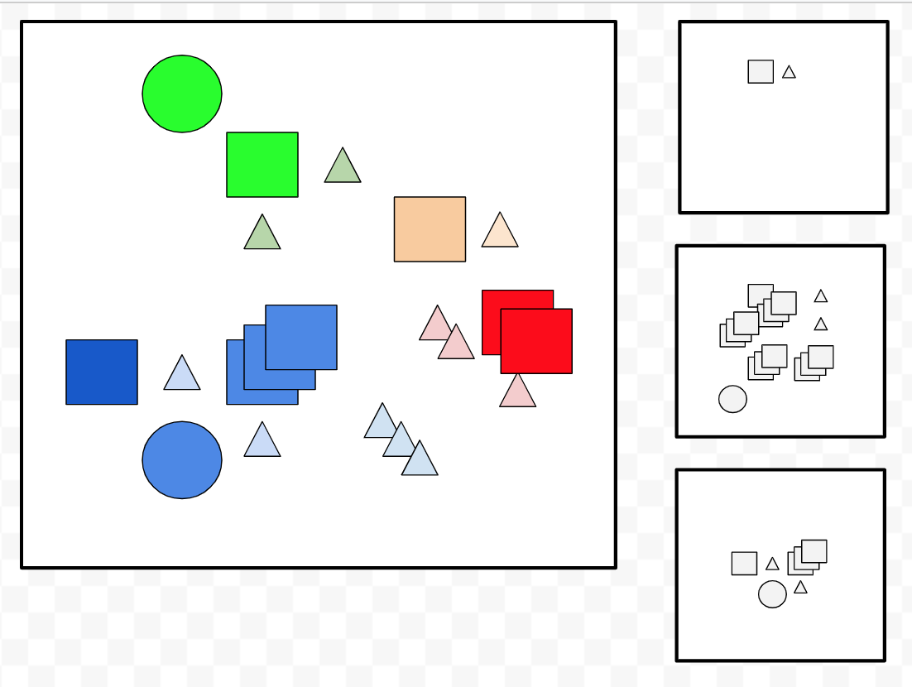

# kubernetes

## Basic Workflow

_The plan: Define resources to describe what you want.  Apply them as a group, at once, so that anything left out can be pruned._

All resources have this core shape:

```
apiVersion: ""    // required - one of `api-versions`, is base of REST url
kind: ""          // required - one of `api-resources`, suffix of REST url
metadata:
  name: ""        // required - must be unique per kind
  namespace: ""   // optional - defaults to current context
  labels: {}      // optional - used to for selection, has restrictions
  annotations: {} // optional - tracking info and stuff, generally unrestricted
spec: {}          // typical - the definition of the resource
data: {}          // typical - the data of the resource
items: []         // typical - occurs in List resources
...               // atypical - other stuff
status: {}        // added by kubernetes
```

This is a good structure.  The apiVersion and kind route these objects to a handler, there is unstructured and structured design space.  The status part is excellent from an implementer standpoint too -- a standard place to save information.

Due to the structure kubernetes can look at the data and know "this is new" or "this has changed".  As a result a group of resources definitions can be applied at once, which enables unspecified things to be identified as unwanted and pruned. It is a "declarative" way of managing resource (the "Advanced" way of managing things - a do-this-do-that "imperative" approach is the "Beginner" way).

To reiterate - the idea is to define resources to describe what you want.  Apply them as a group, at once, so that anything left out can be pruned.  How do?

## Apply a group of resource definitions

Resource definitions can be fed to `kubectl apply` as stream of JSON objects, or they can be formed into a List resource, or (in recent versions) you can group them into files in a directory and provide that.  YAML is an alternate way to specify the JSON.  The metaphor is a stream so you can organize as you like.

```bash
cat resource.json resource.yml | kubectl apply -f -
kubectl apply -f resource.json
kubectl apply -k resources_dir
```

_Sidebar: kubectl apply does not have a good command line design... `-f` could easily be a list of files and if it were then neither `-f` nor `-k` would be needed. IMO it suggests the culture of the developers.  Kubernetes seems designed with web sensibilities and kubectl nails web things, and could be command line friendly, but isn't._

```bash
# pretend the command signature was: kubectl apply [FILES...]
cat resource.json resource.yml | kubectl apply -
kubectl apply resource.json resource.yml
kubectl apply resources_dir/*
```

Resources are very verbose, so you will want to organize.  Also there's a problem - you need to line things up.  Imagine a kubernetes namespace as a bustling bazaar with independent people working in identifiable colors -- that is a cluster.  It is the way it works.



* With prune you use labels and selectors to limit what is in scope - get it wrong and you may delete lots of stuff.
* With services you need to use labels and selectors to pick which containers belong to the service.
* You need to associate configmaps/secrets to pods, at the very least needing name coordination.

This means you have to have a plan, then execute that plan by coordinating values in multiple places.  It is hard to do by hand.  Values may also vary by environment.  You need a template layer.  With high-minded shortsightedness, kubectl has intentionally not provided that so we have to.

The general plan then:

* Have a (name/label/annotation) plan
* Template to make a stream of resource definitions using the plan
* Apply with `kubectl apply --prune`
* Profit

_Sidebar: a google team achieved what the community could not, and convinced kubernetes to include [kustomize](https://kustomize.io/) into kubectl in recent versions -- they say it isn't templating but it amounts to the same thing.  It's a reasonable thing to imagine switching to it, especially when docker-for-mac updates._

## A Plan

1) Connect related resources by name to make components.

2) Add lifecycle labels to order the rollout of resources (ex to ensure the latest configs/secrets are available, or to make sure db migrations go before a server rollout).

3) Use namespaces to avoid further grouping (also important for secrets).

4) Use [checksum annotations](https://github.com/helm/helm/blob/master/docs/charts_tips_and_tricks.md#automatically-roll-deployments-when-configmaps-or-secrets-change) to ensure pod changes when configs/secrets change.

### 1. Connect by name into components

Kubernetes groups containers into pods; you can only run a container within a pod.  Pods have their own network, so this is a good way of getting related processes into one cohesive unit.  All these examples are in the 'examples' dir.

```bash
cd examples
```

Run a container as a pod.

```bash
## docker version
docker run -it --rm debian:stretch-slim date -u "+%Y-%m-%d:%H:%M:%S (docker1)"

# k8s version
kubectl get pods
kubectl apply -f timepod1.yml
kubectl get pods
kubectl logs timepod1
kubectl delete pod/timepod1
```

Configure with ENV variables.

```
## docker version
docker run -it -e FORMAT="+%Y-%m-%d:%H:%M:%SZ (docker2)" --rm debian:stretch-slim /bin/sh -c 'date -u "$FORMAT"'

# k8s version
kubectl get pods
kubectl apply -f timepod2.yml
kubectl get pods
kubectl logs timepod2
kubectl delete pod/timepod2
```

Move values to a ConfigMap.

```
kubectl apply -f timepod3.yml
kubectl get pods
kubectl get configmaps
kubectl get all
kubectl get configmaps -o yaml
kubectl logs timepod3
kubectl delete pod/timepod3 configmaps/timepod3

# note tracking many objects is a hassle, so reuse `-f` metaphor
kubectl apply -f timepod3.yml
kubectl logs timepod3
kubectl delete -f timepod3.yml
```

The linking is something we establish by name.  Conventions are helpful but ultimately it is arbitrary.  The easiest thing is to link by name.

```
kubectl apply -f timepod3a.yml
kubectl logs timepod3a
kubectl delete pod/timepod3a configmaps/arbitrary-name
```

Writing each ENV variable does not work for many variables.  Use a volume to place each value into a file.

```
kubectl apply -f timepod3b.yml
kubectl logs timepod3b
kubectl delete -f timepod3b.yml
```

If you still like ENV variables, then add a wrapper to make the files into ENV variables.

```
docker build -t with_env_image .
kubectl apply -f timepod3c.yml
kubectl logs timepod3c
kubectl delete -f timepod3c.yml
```

Wrapper strategy is nice as all the same things work with Secrets (obnoxiously with a different set of keys).  Values need to be base64, **not** for security.  Might be they want to accommodate binary data, which only kinda makes sense as JSON can do that (albeit verbosely), but maybe it's to play nice with ENV variables?  At any rate, it's what you do.

```
# ENCODING IS NOT ENCRYPTION -- NO SECURITY IN BASE64
base64 <<<"+%Y-%m-%d:%H:%M:%SZ (timepod4)"
base64 -D <<<"KyVZLSVtLSVkOiVIOiVNOiVTWiAodGltZXBvZDQpCg=="

kubectl apply -f timepod4c.yml
kubectl logs timepod4c
kubectl delete -f timepod4c.yml
```

Note with secrets it is important to not directly put values into the env, as it will be highly visible.  Look back at timepod2.  You always want to either reference the value in an ENV variable, or make a volume.

```bash
kubectl apply -f timepod2.yml
kubectl get pod timepod2 -o json | jq '.spec.containers[].env'
```

It's worth reflecting on the API again.  Note api/v1, then namespace, then kind, then name.

```bash
kubectl proxy &

kubectl get pod timepod2 -o json
kubectl get pod timepod2 -o json -v=9 2>&1 | grep curl
curl http://localhost:8001/api/v1/namespaces/default/pods/timepod2

kubectl logs timepod2
kubectl logs timepod2 -o json -v=9 2>&1 | grep curl
curl http://localhost:8001/api/v1/namespaces/default/pods/timepod2/log

kubectl delete -f timepod2
```

This is SUPER easy to work with, if you have to automate.

```bash
kubectl apply -f timepod5.yml
curl -s http://localhost:8001/api/v1/namespaces/namespace5/pods/timepod5
curl -s http://localhost:8001/api/v1/namespaces/namespace5/pods/timepod5/log | grep timepod

kubectl delete -f timepod5.yml
```
